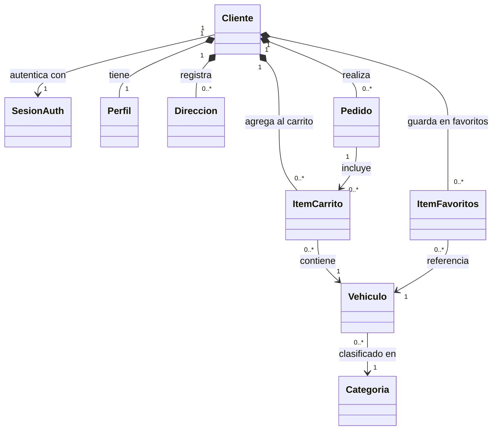

# Diagrama de Clases — AutosEnfasis-I

> Basado en los esquemas del estado Redux, las acciones de API y los componentes de UI.
> Solo relaciones, sin atributos internos.

---

## Descripción de entidades

| Entidad | Descripción | Origen en el código |
|---|---|---|
| **Cliente** | Usuario registrado y autenticado | `user-slice.js` |
| **SesionAuth** | Token JWT almacenado en localStorage | `user-slice.js` → `user.token` |
| **Perfil** | Datos del cliente (email, teléfono) | `user-slice.js` → `profile` |
| **Direccion** | Dirección de entrega del cliente | API `POST /customer/address` |
| **ItemCarrito** | Vehículo agregado al carrito con cantidad | `user-slice.js` → `cart[]` |
| **ItemFavoritos** | Vehículo guardado en lista de favoritos | `user-slice.js` → `wishlist[]` |
| **Pedido** | Orden de compra generada desde el carrito | `user-slice.js` → `orders[]` |
| **Vehiculo** | Producto del catálogo (nombre, precio, imagen, tipo) | `shpping-slice.js` → `products[]` |
| **Categoria** | Tipo/categoría al que pertenece un vehículo | `shpping-slice.js` → `categories[]` |

---

## Leyenda de relaciones

| Símbolo | Significado |
|---|---|
| `*--` | Composición (el objeto hijo depende del padre) |
| `-->` | Asociación (referencia independiente) |
| `"1"` / `"0..*"` | Multiplicidad |
